# 🍽️ Foodie-Fi SQL Case Study
A SQL case study analyzing subscription and payment data for a fictional streaming service, Foodie-Fi. This project covers customer journey analysis, subscription analytics, churn analysis, and a payment-generation challenge — solved using MySQL.

## Business Context
Foodie-Fi is a subscription-based streaming service offering customers a 7-day free trial, followed by a choice of basic monthly, pro monthly, or pro annual plans. This case study explores customer onboarding journeys, subscription patterns, churn behavior, and upgrade/downgrade paths.

## Tools Used
- MySQL Workbench

## Database Setup
📄 [Create Tables](./queries/create_tables.sql) — schema creation for plans and subscriptions

📄 [Insert Tables](./queries/insert_tables.sql) — sample data insertion

## A. Customer Journey
Brief description of onboarding journeys for 8 sample customers.
📄 [Customer Journey](./queries/customer_journey.sql)

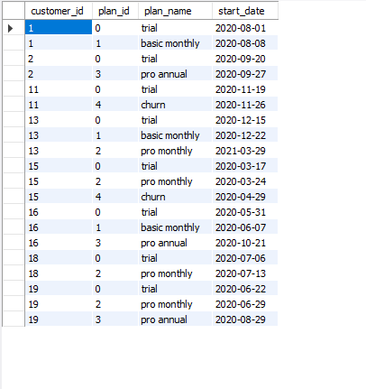

## B. Data Analysis Questions

**1. How many customers has Foodie-Fi ever had?** 📄 [B1](./queries/B1.sql)

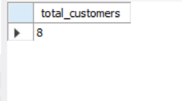

**2. Monthly distribution of trial plan start_date values** 📄 [B2](./queries/B2.sql)

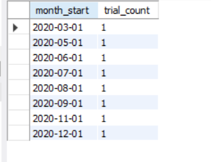

**3. Plan start_date values after 2020, broken down by plan_name** 📄 [B3](./queries/B3.sql)

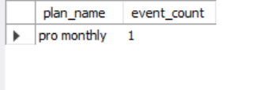

**4. Customer count and percentage who have churned** 📄 [B4](./queries/B4.sql)

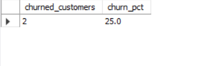

**5. Customers who churned straight after their initial free trial** 📄 [B5](./queries/B5.sql)

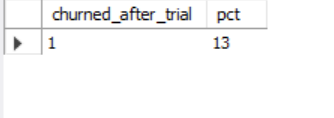

**6. Number and percentage of customer plans after initial free trial** 📄 [B6](./queries/B6.sql)

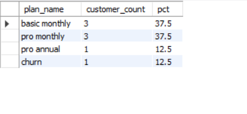

**7. Customer count and percentage breakdown of all plan_name values at 2020-12-31** 📄 [B7](./queries/B7.sql)

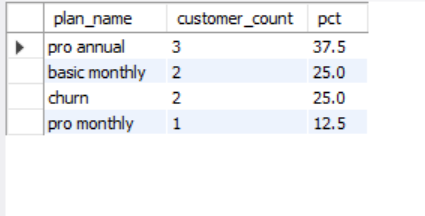

**8. Customers who upgraded to an annual plan in 2020** 📄 [B8](./queries/B8.sql)

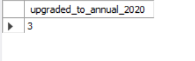

**9. Average days to upgrade to an annual plan from joining** 📄 [B9](./queries/B9.sql)

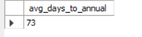

**10. Average days to annual upgrade broken into 30-day periods** 📄 [B10](./queries/B10.sql)

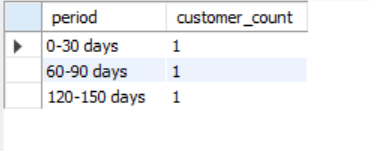

**11. Customers who downgraded from pro monthly to basic monthly in 2020** 📄 [B11](./queries/B11.sql)

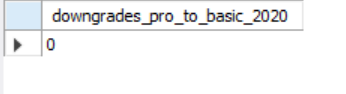

## C. Challenge Payment Question

Built a payments table for 2020 reconstructing every payment transaction per customer, handling recurring billing, prorated upgrades, deferred annual payments, and churn cutoffs.                                                               📄 [Challenge Payment Questions](./queries/challenge_payment_question.sql).

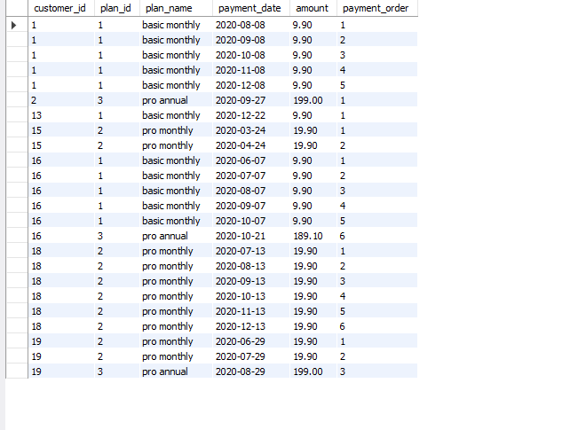

## Credits
Case study created by [Case Study #3](https://8weeksqlchallenge.com/case-study-3/) as part of the 8 Week SQL Challenge.
